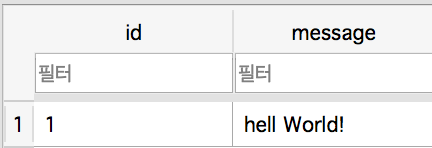
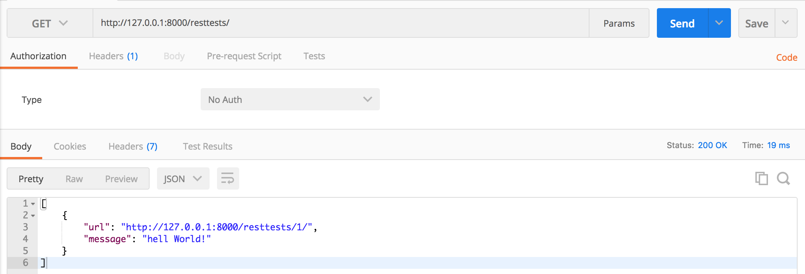

# RestAPI - Django
단순한 Rest API

```python
# urls.py
router = routers.DefaultRouter()
router.register('resttests', views.RestTestViewSet)
```

urls.py 에 router 를 선언, register function으로 간단하게 설정 가능하다.


```python
# views.py
class RestTestViewSet(viewsets.ModelViewSet):
    queryset = RestTest.objects.all()
    serializer_class = TestSerializer
```

register function에 선언되어있는 RestTestViewSet은 serializer_class와 Model을 return해준다.


```python
# models.py
class RestTest(models.Model):
    message = models.CharField(max_length=30)
```

models.py에서는 message 컬럼을 갖는 DB를 만들어준다.




DB는 이렇게 메세지가 들어와있고 PostMan으로 GET을 요청하면

