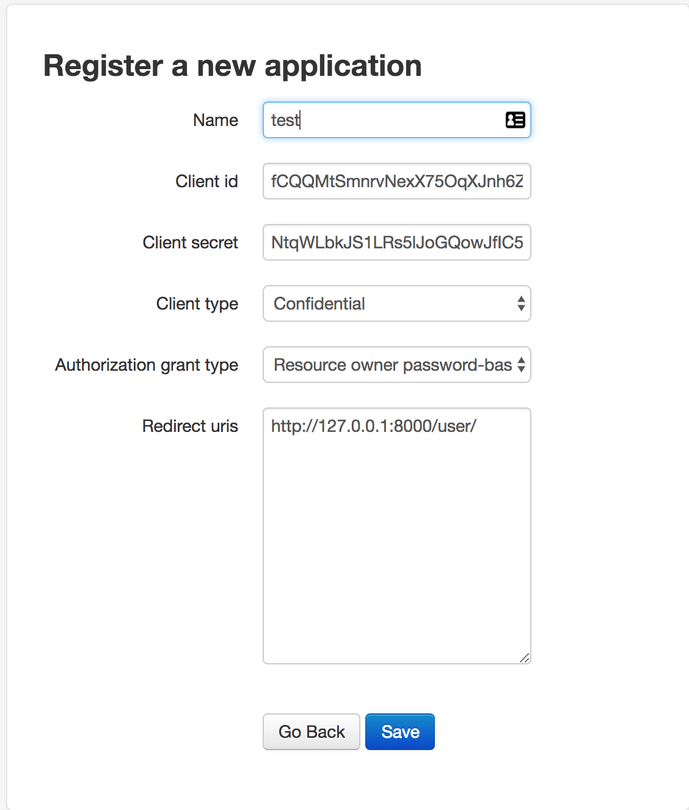
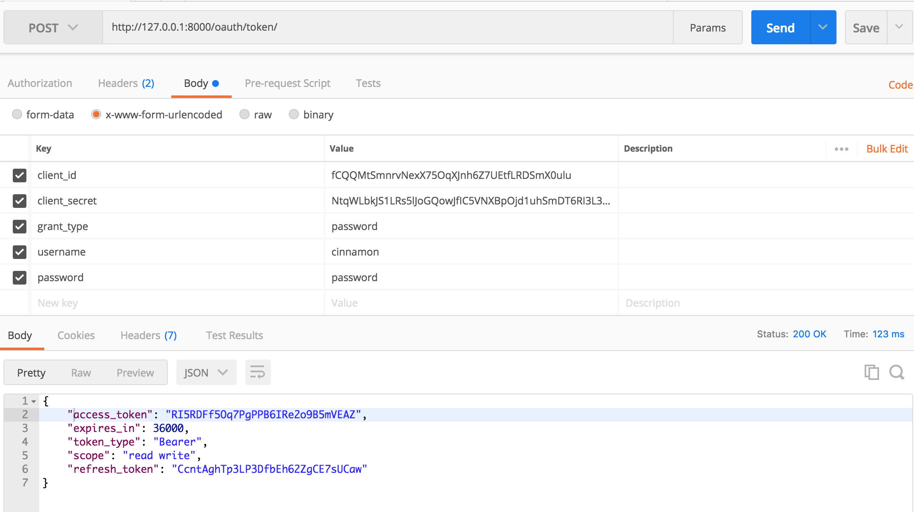

# RestAPI - Oauth

Django에서 Login 하는 방식인 하나인 Oauth를 사용해 본다.


```python
# settings.py
INSTALLED_APPS = [
    ...
    'oauth2_provider', # 추가
    'rest_framework',
]
REST_FRAMEWORK = { 
    'DEFAULT_PERMISSION_CLASSES': (
        'rest_framework.permissions.IsAuthenticated',
    ),
    'DEFAULT_AUTHENTICATION_CLASSES': (
        'oauth2_provider.ext.rest_framework.OAuth2Authentication',
    ), 
}
```

settings.py 에서 Oauth를 사용하기 위해 oauth2_provider를 추가해주고 AUTHENTICATION CLASSES는 OAuth2Authentication 로 선언한다.


```python
# urls.py
router = routers.DefaultRouter()
router.register('user', UserViewSet)

urlpatterns = [
	...
    path('oauth/', include('oauth2_provider.urls', namespace='oauth2_provider')),
    
    path('api-auth/', include('rest_framework.urls', namespace='rest_framework')),
    path('', include(router.urls)),
]
```

oauth 관리를 위해 urlpatterns를 수정하고 router를 선언해준다.


기타 설정 후 Oauth에 사용할 토큰을 만들어주기 위해 아래 주소로 접속한다.

http://127.0.0.1:8000/oauth/applications/register/




토큰 이름과 client type, Authorization grant type을 설정해주고 성공시 Redirect 할 url을 설정해준다.

그리고 생성된 코튼을 저장해둔다.




Type 은 Post client id, client scret, user 정보 를 입력 후 Send 하게 되면 access token을 받아올 수 있다.