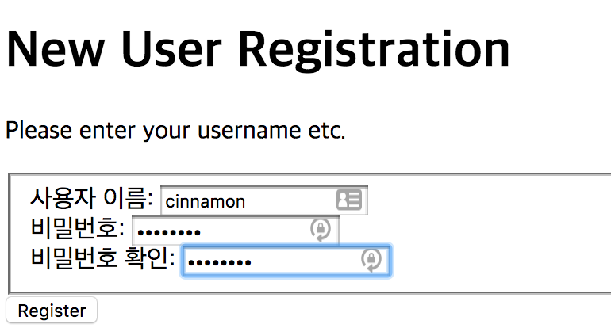
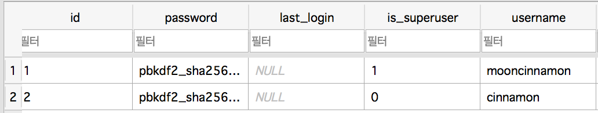
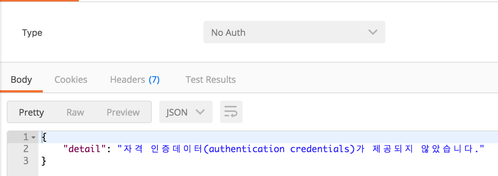
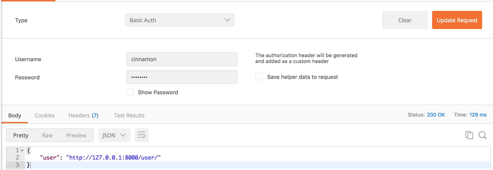
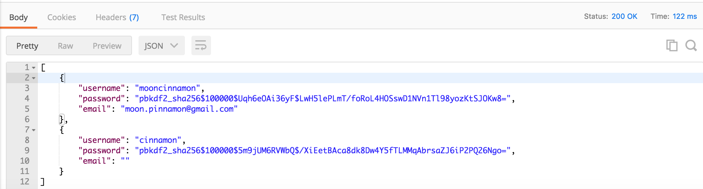

RestAPI - Basic Auth

Django에 있는 auth 를 사용해서 Basic Auth 처리 해보자


먼저 계정을 만들어 준다.



```python
# settings.py
REST_FRAMEWORK = {
    'DEFAULT_PERMISSION_CLASSES': (
        'rest_framework.permissions.IsAuthenticated',
    ),
}
```

settings.py 에서 REST_FRAMEWORK 에서 IsAuthenticated 옵션을 넣어준다


```python
# urls.py
router = routers.DefaultRouter()
router.register('user', UserViewSet)
```

urls.py 에 user을 return할 router를 선언해준다


```python
# views.py
from django.contrib.auth import get_user_model

UserModel = get_user_model()

class UserViewSet(viewsets.ModelViewSet):
    queryset = UserModel.objects.all()
    serializer_class = UserSerializer
```

특이한 점은 UserModel = get_user_model( ) 부분이다. 따로 User Model을 만든게 아닌 django에서 기본으로 제공되는 User Model을 사용하였기 때문에 models.py를 호출하는 것이 아닌 get_user_model( )로 모델을 호출한다




super user 인 mooncinnamon 말고도 아까 만들었던 cinnamon이 있는걸 볼 수 있다




No Auth의 경우 접근 자체가 되지 않는다




Basic Auth에 아까 만든 계정을 넣어주면 접근이 가능한 것을 볼 수 있다




http://127.0.0.1:8000/user/ 에 접근하게 되면 DB의 모든 정보가 다 보이게 된다

이는 보안상 문제가 있기 때문에 Oauth 방식, 혹은 JWT 방식으로 Login을 처리해야 하는 것을 알 수 있다